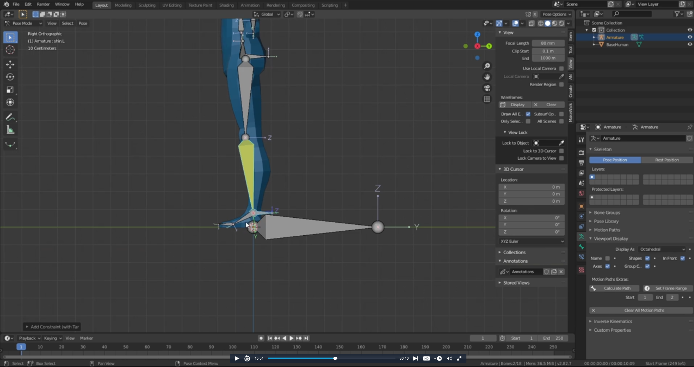

# DEV-01, Chapter 1: Armatures Intro

## Rigging Guinea Pig 

## Adding Bones

    Managing view settings for bones

## Naming, Connecting and Parenting Bones

    Renaming Bones

    Make sure that the origin is at a reasonable spot so that if we plan to "symmitrize" it will make sense

    The first click is the child, the second click is the parent. Then Ctrl P.
    2 divides the influence of 1 on the model

    The large bone, "Root" on the floor is meant to match the orientation the the world.
    The Main, which is on the model is then parented to this Root bone. Then the bones on the model are parented to the Main.
    This will allow in pose mode to move the whole bone structure if you grab either the Root of the Main.

## Setting Up IK Controls

    What is IK? Ik stands for inverse kinematics, and are useful when rigging parts like arms, legs and anywhere that bends.
    Its usually used to control joins that move in relation with each other.

    Add a new bone on top of the metagross leg, this will serve as our constraint. You can rotate the bones if you need to so that th Z axis are all aligned.

    Cleaned up bone rotations

    This is what it looks like in humans

    Be sure to clear the parenting using Alt P

    Rename the constraint bone

    Shift click IK_Front.L and then FrontUpperLeg.L an then F2 to find inverse kinematics

    Applied

    This is what it looks like in humans

    
    Set chain length to 1 in metagross since it doesn't have too many limbs

    
    For humans however, since theres more joints, we would likely want a chain length of 2

    
    Next we will want to lock the Y axis on metagross, given the behavior of how its legs move

    For humans, we would lock both the Y and Z axis

    In pose mode, if you click on the left hand gizmo, and then select Local, you should see the directions that each axis influences

    Extrude Bone, fix rotations, clear parent, and move down along z in metagross. This bone is so that the joint does not reverse itself.
    Poles are used to help blender to understand which way a joint should be rotating

    Extrude Bone, fix rotations, clear parent, and move down along y in human

    What this bone is meant to prevent:

## Working with Poles

    Select the yellow bone and add armature in the setting

    Apply the pole we just made. it will cause it to turn 90 degrees

    Turn it back 90

    Parent the Pole to the IK control

## Apply to other legs

    Add the IK system to the back left leg

    "Symmetrize"

## End Result

